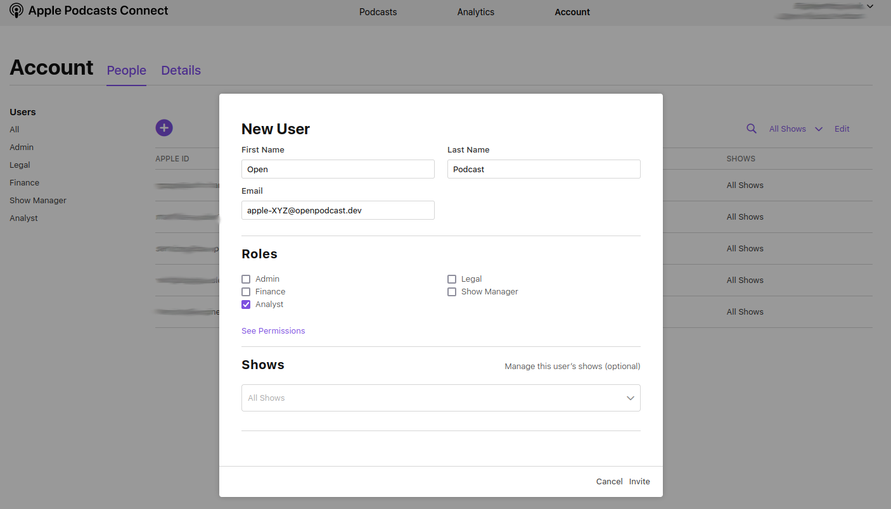

# Connect your podcast to Open Podcast Analytics

If you are part of the beta program, follow those steps to connect your podcast:

## Apple

- Sign in to https://podcasters.apple.com/ using an account that can access the respective podcast and manage user access for the podcast.
- In the top menu you find items `Podcast`, `Analytics`, and `Account`. Click on `Account`.
- On the account management page click on `People`
- Click on the big ⊕ symbol to grant access to another user.
- For first/last name use `Open` and `Podcast`
- Insert the email address we have sent you (e.g. apple-XYZ@openpodcast.dev)
- For the role select `Analyst`
- You can specify the podcast/show to restrict the access to the respective podcast

## Spotify

Login to https://podcasters.spotify.com/ using an account that can access the respective podcast.

     Open Podcast Analytics extension not installed. Please, use Chrome and install the browser extension first. 
     <a href="https://chrome.google.com/webstore/detail/openpodcast-extension/kdgmkjmggjefccigfbeidmaamhbfnkhh">Download and install the Open Podcast Analytics extension for Chrome</a>

